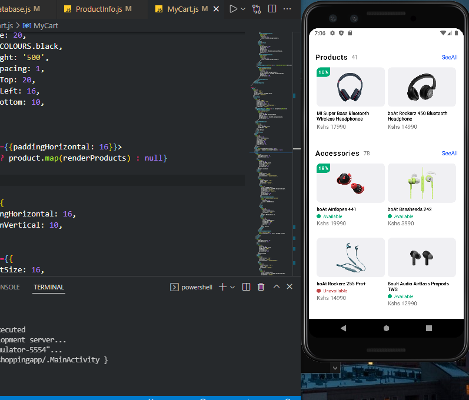
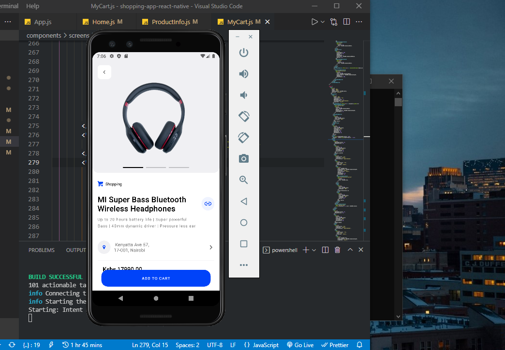

### Shopping mobile app (android & ios)

---

The app was developed using react native (cross plartform framework for native development)


---



### installation

clone the project

Navigate into the project and install all the dependencies
NB: make sure you have node installed [installation instructions](https://nodejs.dev/learn/how-to-install-nodejs)

```bash
npm install
```

Ensure you also have JDK installed and android studio for the SDK

You can now run the app after all configurations are set.
